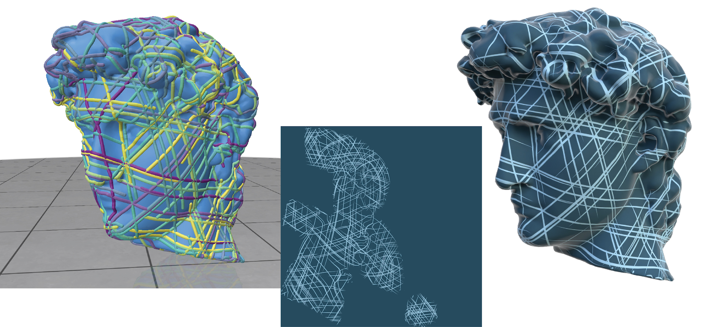

# Streamline Tracer

C++ program to trace streamlines of discrete (face-based) vector fields.



The streamlines can be visualized as space curves with Polyscope (left), exported to obj files, or exported to SVG textures (center) which can be styled using Inkscape or Illustrator and then rendered with Blender (right).

## Getting started
On macOS/Linux, you can build this project with:
```bash
git clone --recursive https://github.com/MarkGillespie/StreamlineTracing.git
cd StreamlineTracing
mkdir build
cd build
cmake -DCMAKE_BUILD_TYPE=RelWithDebInfo ..
make -j7
bin/streamline-tracer /path/to/mesh.obj --viz
```

On Windows, Visual Studio can use the provided CMake files to build and run the project.

## Usage
You can trace streamlines on triangle meshes by running:
```bash
bin/streamline-tracer /path/to/mesh.obj
```

The program accepts various arguments to control the vector field generation and streamline tracing:

### Basic Options
| Flag | Purpose |
|------|---------|
| `--viz`, `-v` | Launch in interactive GUI mode |
| `--svg-name` | If provided, exports streamlines to SVG file |
| `--obj-name` | If provided, exports streamlines to OBJ file |

### Field Options
| Flag | Purpose |
|------|---------|
| `--input-field` | If provided, loads the vector field from file instead of generating a new one |
| `--output-field` | If provided, saves generated vector field to file |
| `--nSym=1` | Set n-rotational symmetry for the vector field (default: 1) |

### Tracing Options
| Flag | Purpose |
|------|---------|
| `--max-segments=150` | Maximum number of segments per streamline (default: 150) |
| `--max-len=6.0` | Maximum length of each streamline (default: 6.) |
| `--min-dist=0.75` | Minimum distance between streamline seeds generated by Poisson disk sampling (default: .75) |

### SVG Export Options
| Flag | Purpose |
|------|---------|
| `--stroke-width=0.05` | Stroke width in world space units (default: .05) |
| `--foreground=#000000` | Streamline color in hex format: #RRGGBB or #RRGGBBAA (default: "#000000") |
| `--background=#FFFFFF` | Background color in hex format (default: "#ffffff") |
| `--image-size=500` | Viewbox size of output svg image |

### File Formats

#### Vector Field Files
Vector fields are stored as plain text files with one 3D vector per face:
```
# Face tangent space vectors
0.707 0.707 0.0
-0.5 0.866 0.0
...
```

#### Input Meshes
If you want to save the streamlines to an SVG texture, the mesh must be passed as an `obj` file with texture coordinates
